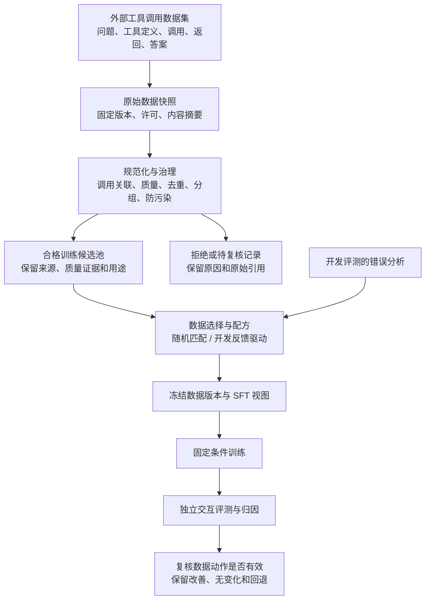

# Implementation Plan: Agent 工具调用轨迹数据工厂

**Branch**: `docs/external-dataset-flow-v21` | **Date**: 2026-09-10 | **Revision**: 2.1 | **Spec**: [spec.md](spec.md)

**Input**: `specs/001-code-data-factory/spec.md` 2.1；本次按用户确认纠正正式训练数据来源。
**Status**: 2.1 流向修订完成；已有软件/环境回执按原范围保留，外部训练准入与实际发布待迁移验收，不宣称本次已完成实现或训练。

## Summary

建设面向“信息查询、计算、单位与时间转换助手”的外部工具调用示范数据产线。主流向为外部已有
示范→治理→合格训练候选池→配方→训练版本→固定条件训练/评测→反馈归因。正式训练示范取自
外部开源数据集；主要成果是质量准入、去重/污染控制、分布式加工、版本谱系、配方和归因。
首版用监督微调（Supervised Fine-Tuning，SFT）及真实交互评测做最小数据价值实验；强化学习
（Reinforcement Learning，RL）与长程扩展的数据和适配契约是强制验收，正式 RL 优化留到下一阶段。

优先组合外部开源组件。自有代码集中于任务语义、来源适配、轨迹对齐、质量规则、配方、验证断言和
归因证据，不实现通用 Agent 循环、优化器、分布式调度器、向量索引或去重算法。

## Technical Context

**Language/Version**: Python 3.12 + `uv`；Linux 兼容门禁失败时整套统一调整版本，不能各运行自行漂移。

**Primary Dependencies**: Pydantic（记录校验）、PyArrow/Parquet（列式数据）、DuckDB（结构化查询语言
SQL 分析和本地全文检索）、Ray Data（分布式批处理）、DVC（Data Version Control，数据版本与依赖
编排）、datasketch（MinHash 近重复候选）、smolagents 的 `ToolCallingAgent`（工具交互）、TRL
（Hugging Face 训练库）、PEFT（参数高效微调库）、MLflow（实验索引）。各库用途和备选见研究文档。

**Storage**: 有哈希的 Parquet、JSON（JavaScript Object Notation，结构化交换格式）、YAML（配置
格式）与二进制产物为事实；DuckDB 索引和 Markdown 报告可重建；不新建在线状态服务。

**Testing**: pytest 契约/集成测试，Ruff 和 mypy；适配器真实导入检查、故障注入、独立验证器正负
对照、本地/分布式等价、真实采样探针和实际 SFT。文档完成不等于这些测试完成。

**Target Platform**: Linux；沿用 OpenBayes 单张 NVIDIA GeForce RTX 5090、32 GB 显存的训练资源
规划，租用前重新验证实际硬件、报价、驱动和持久存储。图形处理器（Graphics Processing Unit，GPU）
并发上限沿用 8 张独立实例，不假定构成同节点多卡。数据处理使用中央处理器（Central Processing Unit，CPU）。

**Project Type**: 单一 Python 包与命令行界面（Command-Line Interface，CLI），批处理任务；无产品前端。

**Performance Goals**: 真实数据加工记录每阶段吞吐、内存、重分布、溢写、重试与成本；延续 64 GiB
固定规模、1/2/4 节点各 5 次测量。GiB 为吉比字节，1 GiB = 2^30 字节。不预设正加速结论。

**Constraints**: 约 12 周；两 SFT 配方、三种子；一个现成训练框架采样适配；首版评测/兼容采样尝试最多
8 次工具调用，累计模型生成最多 4096 词元，单轮模型输入加输出最多 8192 词元；工具返回每次
最多 8192 字节、整次尝试最多 65536 字节，墙钟上限 120 秒。限额是起始校准配置，正式运行前
可统一修订并冻结；不得在结果出来后按组修改。超限显式截断，不静默生成额外“最终答案”。
外部示范按原长度入原始层；训练视图按共同上下文预算完整选择，不套用本地采样步数淘汰原料。

**Scale/Scope**: 现存 Toucan 精选集 119287 条仅为已盘点候选，不保证适合训练。先按来源/任务族
抽审至少 30 条外部示范，不足则全审并明确样本不足；这只是质量规则试点，不是训练规模下限。
根据实际原料数量、各阶段保留率、能力覆盖和有效词元，冻结有界批处理分片与费用上限；不设本地
生成任务配额。可执行分支保留 100 任务先导，仅用于验证。正式池不足则继续筛选外部来源、统一
缩小训练曝光或记录未达标，不靠改写计独立样本，不自行采样补量。

## Protocol Migration

本节显式取代旧冻结项目协议；已存在研究和日志保留为历史证据，不覆盖旧实验产物。

### 2.1 External Dataset Flow Migration

| 2.0 约定 | 2.1 生效要求 | 迁移影响 |
|---|---|---|
| 所有正式成员须可重建环境并实际验证 | 外部示范准入与重放/结果/奖励证据分开 | 不伪造执行；独立审核可发布合格 SFT 示范 |
| 外部历史数据主要作任务参考，本地派生重新采样 | 外部已有示范治理后进入正式训练池 | 原工具定义保留，格式修复保留原记录与派生链 |
| 5000 任务、每题 4 次、最多 20000 次生成 | 取消自采样配额；规模依外部合格量/覆盖/词元与预算冻结 | T045–T047 改为外部试点、批量治理和发布 |
| 数据发布依赖本地任务先导与扩大采样 | 外部发布独立；受控环境用于验证/评测/RL 兼容 | 断开 T044/T058 对正式数据发布的前置依赖 |
| 数据不足后扩充本地任务 | 增加外部来源或重选数据；修复重新审核 | 首版没有自行生成训练池的后门 |

**文档与实现迁移边界**：本次只修订 spec/plan/tasks。旧 `data-model.md`、`contracts/artifacts.md`、
`contracts/cli.md`、`research.md`、`quickstart.md`、检查单与 README 中和本节冲突的来源/准入/状态
表述不再作为 2.1 实施依据；其余算法、费用、公平性和运行协议保留。T103 先同步这些派生文档并
定义有版本的迁移契约，T104–T108 完成测试与实现迁移，之后才能 T045 的真实外部准入。
不就地把既有 HISTORICAL_ONLY 记录改为 TRAIN，不重签已有执行/训练证据。已勾选 T001–T044
保留原 2.0 验收范围，新要求用独立任务与回执承接。

### Earlier Code-to-Trajectory Migration

以下为 2.0 的历史迁移；与上表冲突的数据来源与任务生成含义以 2.1 为准。


| 原协议 | 本版决定 | 理由与影响 |
|---|---|---|
| Python 代码来源与一次生成转换/修复程序 | 任务包、完整交互尝试与工具返回 | 数据质量从单条答案扩展到交互完整性和跨步依赖 |
| `ArtifactPass@1`、`RepairPass@1`、`DataEngineeringArtifactBench-v1` | `TaskSuccess@1`、恢复切片和未见组合切片，详见评测节 | 不沿用代码产物指标语义 |
| LiveCodeBench、DataSciBench、BIRD/Spider 的固定外部矩阵 | BFCL V4 官方本地多轮/无关工具类别的固定子集 | 旧代码和 SQL 锚点退出首版验收，降低无关评测成本 |
| 原 2048 词元起始上下文 | 8192 词元起始上下文，按轨迹长度统一校准 | 不截去多轮依赖后再宣称轨迹训练 |
| 第一候选 `Qwen/Qwen3-8B`、代码模型备选 | 保留第一候选；工具模板不通过时用 `Qwen/Qwen3-4B` 作事前备选 | 模型作为测量仪器；取消代码特化备选，不搜索最佳分数模型 |
| 可选单次输出奖励导出 | 强制任务环境、采样适配与长程/稀疏奖励验收 | 导出文件不代表在线采样兼容 |
| 原两个 SFT 配方、种子 `[17,29,43]`、等预算 | 保留；只迁移切片语义并明确目标干预 | 保持数据价值归因 |
| 原 64 GiB、1/2/4 节点各 5 次 | 保留，数据改为轨迹表与事件表 | 继续证明批处理、性能、稳定性和逻辑一致性 |
| 原 `tasks.md` 及旧命令/实体 | 重写设计衍生产物；用户随后授权按 2.0 重生任务清单 | 旧编号不继承完成状态，新清单给出依赖、验收和覆盖 |

## Constitution Check

设计前后均按宪章 3.0.2 检查；无原则豁免，不修订宪章。

| 原则 | 本版落实方式 | 设计审查 |
|---|---|---|
| I 真实训练 | 六次正式参数更新、检查点、实际交互结果后才可作模型价值陈述；示范准入不宣称模型收益 | 通过；运行按实际回执验收 |
| II 公平归因 | 同池、明确目标变量、固定有效词元/步数/计算配置、三个种子、预登记 | 通过；不以诊断代替因果 |
| III 端到端谱系 | 来源→外部示范/事件→质量审核/选择→版本→训练→评测→反馈/结论；可执行任务与验证另关联 | 通过；原记录/修复/采样各有身份 |
| IV 证据分级 | 接口测试、真实采样、隔离执行、真实训练分开记录 | 通过；未知奖励不填零 |
| V 结果完整 | 失败、中止、截断、无提升、成本与全部种子终态保留 | 通过 |
| VI 来源时效 | 保留 [research.md](research.md) 的一手来源证据；数据年代与训练准入分开，2.1 选源/准入结论由 T103/T045 补核 | 本轮未新增外部能力结论；实际来源及兼容性待验证 |

本轮确定外部数据主线及分用途准入，不宣称已有候选满足新版训练要求。T103 同步派生契约与研究
结论，T045 核验实际来源，后续以冻结版本、实际质量和验收产物决定是否进入正式实验。

## Architecture



主线只消费外部已有示范及可审计修复；原始层不可变，质量/选择/版本逐层留痕。

```text
有环境的外部任务 / 受控验证任务
  -> 固定动作重放与独立验证 -> 可重放子集的附加质量证据
  -> 开发与最终交互评测 -> 开发错误分析 -> 选择/配比与归因
  -> 现成训练器采样兼容 -> 后续单独登记的 RL 优化
```

分支共用记录与工具契约，但无自动回流到首版 SFT 的路径。无可执行环境时主线仍可发布外部示范；
环境检查和真实采样各按原门禁验收。最终测试只流向结果报告，不反馈选数。

### Component Responsibilities

| 能力 | 优先复用 | 项目自有边界 | 明确不自研 |
|---|---|---|---|
| 原料获取/读取 | `huggingface_hub`、PyArrow | 固定来源清单、列映射、许可/可执行性审计 | 下载服务和数据格式 |
| 数据解析与校验 | Pydantic、PyArrow | 轨迹契约、坏记录隔离、对账 | 校验框架 |
| 批处理/恢复 | Ray Data/Ray Jobs、DVC stage | 算子组合、提交清单和幂等标识 | 集群调度器、编排平台 |
| 近重复/污染 | datasketch MinHash/LSH；可选 Sentence Transformers + FAISS 复核 | 文本投影、任务关系、阈值校准、保留策略 | 哈希/向量算法与索引 |
| 交互评测/采样兼容 | smolagents `ToolCallingAgent`、模型适配接口 | 验证与评测工具、事件记录、预算守卫；输出不进入首版训练池 | 通用 Agent 循环、多 Agent 平台 |
| 工具执行 | DuckDB 全文检索、Python 标准库 `decimal`/`zoneinfo`、Pint | 只读搜索、按标识读取、四则运算、单位/时间转换的薄函数 | 搜索服务、任意代码解释器、时区规则 |
| 质量/选数/归因 | DuckDB SQL、现成统计库 | 质量断言、依赖审核、分布约束、数据配方 | 通用质量平台、因果算法框架 |
| 训练/采样 | TRL + PEFT + Transformers | 数据导出、预算核验、训练产物采集、一个环境适配 | 优化器、RL 平台、分布式训练器 |
| 评测 | BFCL 官方 runner + 本项目任务验证断言 | 子集与偏离登记、任务结果/证据验证 | 外部基准重实现 |
| 版本与实验 | DVC、MLflow | 显式语义谱系与发布门禁 | 数据版本系统、实验平台 |

LSH 指局部敏感哈希候选检索；FAISS 是向量相似检索库。MinHash 检测集合近重复，不称为语义去重。
语义复核只有在人工标注对证明词面方案漏检且预算允许时才启用，两种模式分别报告召回与误合并。
DVC stage 承担有向无环依赖图编排，Ray 负责执行；不再同时引入 Airflow、Spark、DataTrove 的
第二套执行器。若现成算子满足要求，优先导入而非复制源码，例外须记录证据与维护成本。

### Capability-to-Evidence Mapping

| 数据工程职责 | 可演示成果 |
|---|---|
| 解析、标准化、质量与分类采样 | 不同历史格式→统一事件；接受/拒绝对账；任务切片及配比报告 |
| 分布式计算、吞吐和稳定性 | 本地/Ray 等价、1/2/4 节点原始测量、写入中断恢复 |
| 数据资产、元数据、血缘、生命周期 | 版本成员→原始轨迹双向追溯；撤销影响清单；可重建发布 |
| 外部数据质量与轨迹分析 | 上游示范审核、确定性修复链、跨步错误分析、可重放子集与验证器假成功检测 |
| 训练数据交付与反馈回流 | 合法 SFT 视图、开发短板→选择配方→固定条件复评 |
| 长程与后续训练复用 | 同环境采样适配回执、上下文/恢复和稀疏奖励质量报告 |

职位材料的逐条对应另存本地研究记录，公开文档不承诺覆盖多模态、底层存储、反爬、复杂中后台或算法岗位。

## Task and Data Production

### External Demonstration Intake

复用 `huggingface_hub` 与 PyArrow 获取外部数据，冻结仓库/修订、许可、原始分片哈希、上游记录
与消息索引，保留工具定义、用户指令、模型调用、观察和答案。Toucan 只是已有候选；当前用途为
HISTORICAL_ONLY 的记录必须经新版政策重新审核，不默认整库改为训练用途，也不因工具名与本地
不同而整库排除。T045 保存实际来源调查、代表样本审查和接受/拒绝依据；不合格则换外部来源。

来源选择门禁检查许可/字段完整性、可审核的示范质量、查询/计算/转换/跨步依赖覆盖及原生工具定义。
建立上游工具语义与评测能力切片映射，只用于分类与覆盖分析，不将原调用/返回伪装成本地工具结果。
评测仍使用冻结本地工具及外部基准；覆盖不相符时先修正选源/切片和记录限制，不能用自建示范凑齐。

### Independent Eligibility and Evidence

| 判定 | 必需字段/证据 | 不得混淆 |
|---|---|---|
| 外部身份与来源 | source/revision/分片/记录/消息引用；上游合成属性；修复父链 | 本项目模型采样、评测/夹具不能标外部训练来源 |
| 示范训练准入 | policy_version、接受/拒绝/待复核、理由、审核证据；工具定义、必要上下文与语义一致性 | 来源自报成功不是充分质量证据；不能以可重放性单独作训练准入 |
| 可重放性 | 支持/不支持/未知，环境与初始条件引用及缺失原因 | 缺环境字段可空，不能为创建外部示范而伪造可执行任务包 |
| 结果与奖励 | 上游声明、独立验证方法、证据范围、判定/奖励及版本 | 未独立确定则未知；不因训练接受而写 PASS 或奖励 1 |
| 采样消费 | 实际策略、原始采样词元与输出标记，框架兼容回执 | SFT 重新分词不变成在线采样证据 |

T103 明确契约版本与兼容规则。外部示范关联上游任务身份/指令和工具定义，实际可执行 TaskPackage
保持独立；原始产物不可变，新增准入决策不能覆盖原审计。规则检测可判定的参数/单位/依赖错误，
质量不确定时抽审、隔离或拒绝；抽检不自动为全部成员签发结果 PASS。先冻结规则，再批量执行，
人工抽审至少 30 条覆盖所纳入来源与主要切片，少量来源全审并单列局限。

确定性格式、唯一调用关联修复产生新记录；原始正文及转换规则可追溯。不补写缺失模型推理、工具
返回或答案。新增来源/修复都重进全套治理，先按来源/模板/重复关系登记集合，再派生数据。当前
实验冻结后，新增内容只进入下一候选池版本，不能单独加入处理组。

### Executable Verification and Evaluation Branch

现有四类本地工具（资料搜索、按标识读取、受限计算、单位/时间转换）及 Linux 受控执行保留，
服务于可重放外部子集、交互评测和 RL 兼容。Python 文档与数值规则派生的 100 个先导任务仅为
验证资产，固定动作执行两次；至少 35 个正负对照保持原验收，不能作为训练数据来源或外部多样性。
真实模型调用限于评测和既有兼容探针，费用单独统计，不设置训练轨迹生产配额。环境不可用时只
阻塞此分支，不阻塞证据充分的外部示范治理和本地发布。

## Canonical Data and Quality Pipeline

1. 冻结来源、许可、工具与语料版本，原始数据只读保存；规范化失败逐条隔离而非丢弃。
2. Pydantic 校验外部示范与可执行任务的独立实体，PyArrow 保存事件、工具定义、原始/标准化映射和证据。
3. 来源适配器还原已存在的消息/调用关联，不执行其中的工具或重新采样。标准化缺失保持缺失。
   smolagents 仅在评测/验证分支记录真实交互，不参与正式训练数据生产。
4. 示范门控检查调用/返回对应、参数与工具定义、必要上下文、质量证据、污染、重复和能力切片；
   终局结果与可执行性是独立维度，只有实际证据可签发对应判定。
5. datasketch 产生近重复候选，DuckDB/Ray 处理任务与来源关系；人工抽审至少 100 对，冻结阈值和
   成员选择规则。质量规则先冻结再构建正式数据；不以单一综合分直接准入。
6. DVC 管理不可变输入/发布依赖，清单原子提交；实际动作与谱系单独存表。去重/切分的跨分区索引
   属于全局依赖，增量构建必须扩展到受影响簇，不只处理新增文件。
7. DuckDB 汇总各来源原始/规范/合格/发布记录、保留率、独立任务/派生数、有效词元、质量/奖励缺失、
   配比及数据获取/治理/复核成本；评测和采样兼容费用单列。MLflow 仅做运行索引。
8. 合格候选池以不可变清单冻结；其 SFT 数据版本/导出只读取外部来源和准入决策，无本地模型生成
   或交互环境依赖。分别留存拒绝/待复核，不要求全部成员 outcome=PASS。

SFT 是规范数据的派生视图。只训练 assistant（模型输出）中经规则选定的片段；用户、工具返回、
输入侧角色包装和填充不参与损失；模型实际需要生成的调用边界及结束词元按冻结模板计入目标。恢复轨迹的错误动作保留在上下文，可按冻结规则将其损失置零；后续正确
恢复动作才能作为目标。未知错误位置时整条拒绝，不自动逐步贴标。过长样本不能默默截成残缺对话。

## Execution and Verifier Contract

初始资源与工具库只读提供给平台提供的无特权 Linux 容器执行账户，每次尝试独立工作目录、内存/CPU/进程/
时间限制、默认无网络；模型推理在环境外，通过受控动作通道进入。首版不执行模型生成代码，因此无需先建设通用
代码沙箱。若外部基准必须执行不可信代码，该子集须追加 gVisor 等已验证隔离门禁，未通过则不运行。

工具返回、模型最终答案、环境最终状态分别保存。验证器只由数据/评测控制进程调用，检查结果值、
单位/时间语义、来源证据和全部约束；不限制正确动作路径。数值验证使用独立公式/固定真值和容差，
不能只是再次调用同一个可能有缺陷的工具。负对照包括错单位、错来源、错数值依赖、虚假成功反馈、
无关引用和终局错误，验证器审计不由生成参考答案的模型独自完成。

分开保存 `end_reason`（结束原因）、`outcome`（任务判定）、`verification_status`（证据状态）；
封存尝试仅存执行终态，任务判定以独立验证记录为权威，用关联视图展示，不回写历史尝试。
未知奖励为空，已验证失败才可映射为零。重新评分只读固定证据；环境升级后的重执行产生新尝试。
每次评分均记录验证器和奖励映射版本，旧结果不能被覆盖。

## RL and Long-Horizon Extension Gates

本节实现 FR-031–037，首版不可为了缩减范围删成“可选 RL-ready 导出”。详细接口见
[contracts/interaction.md](contracts/interaction.md)。

| 首版必做 | 后续接入 RL 新增 | 更难长程任务新增 |
|---|---|---|
| 独立任务与工具/验证器，可复位环境 | 同一环境对接 TRL 的在线采样和参数优化 | 新任务族和难度层级，不重建核心实体 |
| TRL 环境工厂适配、真实模型采样探针 | 策略更新/权重同步由上游负责 | 采样效率、探索和可学习难度配比实验 |
| 事件、调用关联、逐轮可见上下文；真实探针原采样词元与输出标记 | 概率等具体算法所需附件 | 支持具体环境的状态快照/分支；上下文处理策略 |
| 32/128 步固定长程案例、一个受控恢复例 | 单独登记采样与优化预算 | 长程真实模型评测和训练收益实验 |
| 终局稀疏奖励、未知分离、重评分 | 选定奖励规则和在线数据筛选 | 经独立检验的奖励变更；不自动密集化 |

首选 TRL `environment_factory` 适配：重用同一任务装载、独立工具方法和奖励读取；优先沿用训练器
多轮循环。当前接口不足时先记录实际缺口，再评估其 `rollout_func` 扩展点；不在首版同时实现 verl。
smolagents 产出的历史 messages 不能直接作为在线 RL 词元；采样词元由训练框架真实生成并原样保存。
接口探针使用相同模型和资源门禁，至少两任务各两次采样，不更新参数；模型失败也有效检验记录契约。
另用固定动作检查两个入口的环境语义一致，不要求随机模型生成完全相同路径。

32/128 步测试使用确定性工具动作与上下文夹具，不要求模型正确走 128 步。核心事件表、引用和序号
必须可处理；至少一例基于冻结只读语料和会话工作区的中间快照恢复，恢复新 attempt（尝试）关联父
尝试和分支点；只回看日志不计恢复。生产数据库、实时网站等不在此能力声明内。

上下文压缩/清理事件保存前后实际输入；未来 RL 遇到历史重写时，适配器必须显式声明如何分段及
计算训练损失。不支持的形式拒绝训练消费，禁止把重写后的全文重新编码当原采样。首版正式 SFT
不启用自动摘要算法；长程夹具验证记录能力，后续再选择摘要/记忆策略。

稀疏奖励报告以任务为单位保存尝试数、已知奖励数、成功数、全零任务比例、未知比例和单位成功成本。
诊断项不自动进入奖励；能生产/消费长程轨迹不等于已有足够学习信号或保证训练收敛。

## Experiment Design

### Frozen Comparison

两配方 `SFT-RandomMatched`（匹配随机选择）和 `SFT-ClosedLoop`（开发反馈驱动选择），种子
`[17,29,43]`，共六次正式运行。共同初始模型只作未训练背景，不作等预算对照。

首版目标干预为“依据开发集失败类型选择覆盖相应错误/恢复模式的示范”。两组来自同一冻结外部合格示范池，
匹配来源、粗任务族、依赖深度档、长度档、验证强度和事前基线难度；**失败类型覆盖是目标差异，
不作为匹配项强行配平**。报告这些变量的联合支持区间；某切片无可匹配对照时共同剔除并报告。
外部来源/修复构成的新版本不得中途混入一组；同池选择与配比优先，不通过自采样填补失败切片。
不能用同源任务进入 test；以来源—模板派生关系的连通组作为统计聚类单位，粗任务族只作分层标签，改写不能充当独立统计样本。

曝光规则两组一致，先以完整轨迹/完整目标消息构建满足相同步数、相同有效损失词元及相同输入计算
预算的 batch（训练批次）清单；不允许拆断依赖或尾部临时补 token。若整数匹配无法达到，统一降档
后重新构建；不等预算不进入正式对比。有效词元指非填充、实际参与损失的模型输出词元；每轮实际
值须等于计划。输入计算预算以冻结的步数、每步批次形状、上下文长度、精度和硬件为口径；真实非填充输入词元另报。
GPU 秒和现金费用是观测结果，不伪造精确相等。

模型沿用 `Qwen/Qwen3-8B` 为第一候选，`Qwen/Qwen3-4B` 仅在工具模板/资源门禁失败时作为共同
备选。它们是测量候选，不宣称当下最强。先冻结官方修订、分词器、对话模板、thinking（思考模式）
开关及调用协议；旧历史方法/模型不得绕过当前兼容性门禁。全参数微调、低秩适配（LoRA）和量化
低秩适配（QLoRA）按全参数→LoRA→QLoRA 顺序做成本/兼容可行性检查，选择首个通过者；明显
不符合显存估算者直接保留拒绝记录。真实反向传播、至少 10% 显存余量、有限损失、保存/重载和六次
成本预算均通过才冻结，不做方法效果比较或超参数搜索。

### Interactive Evaluation

- 项目套件名为 `ToolTaskBench-v1`，明确是项目自建扩展。先导后冻结至少 200 个开发任务和 200 个
  最终测试任务，三个任务族各至少 40 个；测试中至少 50 个未见工具组合/依赖结构任务。来源组与
  模板派生组不跨集合；可共享基本工具，不把未见措辞称为未见任务。
- 主指标 `TaskSuccess@1`：在冻结预算内一次完整尝试、所有目标/证据/约束通过的任务比例。模型
  错误、超限和取消都保留；基础设施故障按预登记规则最多原配置重试一次，仍失败的任务在主指标
  全分母中计未成功，并另报有效执行覆盖和条件成功率。存在未解决基础设施故障时不发布正式模型
  因果结论。不得静默移除难题。
- 恢复切片成功率、未见组合成功率、调用次数、生成词元、延迟、费用和约束违反率单列。恢复切片
  由任务预设可恢复条件定义，不能只选择事后“有恢复成功”的轨迹。
- 外部锚点为 Berkeley Function Calling Leaderboard（BFCL）V4 的官方本地多轮及无关工具类别。
  使用官方网页指向的 `f7cf735` 提交作为选定基线，实施时解析完整提交与数据摘要，冻结固定任务
  标识和 runner；不能自动跟随 main。官方方法、子集排除理由、工具可用性和适配偏离分别记录。
  子集独立报告官方类别指标，不与项目主指标加权，不自称完整 BFCL 分数。
- 测试内容只对污染扫描与独立评测角色可见，生成/反馈过程不可见；训练数据、全部方法和预算冻结
  后解锁一次正式 test。外部测试也不得成为数据生成来源。

主比较为 ClosedLoop 减 RandomMatched，报告每种子差值、均值、标准差和按来源—模板派生连通组聚类的
配对重采样 95% 区间；同一抽样组在两配方间配对保留，种子差值单列。测试至少需 20 个独立
连通组，预登记组分布、10000 次重采样与固定统计种子；不足则停止确认性归因，只报告描述结果。三个种子的统计强度有限，区间不能被解释为跨任意模型/领域的因果保证。
预登记实际意义阈值为 2 个百分点；正收益结论同时要求均值达到阈值、95% 区间下界大于零、六次
完成、公平性通过；外部/未见组合/恢复切片回退不超过 2 个百分点，约束违反率不增加超过 1 个百分点。
阈值可在正式结果前依据先导灵敏度统一修订并记录，不能结果出来后降低。

若主指标改善但护栏未过，报告“目标套件改善并伴随回退”，不发布无条件净收益；其余按负向、
无实际意义改善、不确定或未完成报告。至少一个真实开发发现→数据选择→实际复评形成闭环。

## Distributed Data and Cost Plan

Ray Data 只处理可信数据算子，不在 worker（工作进程）执行任意模型代码或把整段长轨迹塞入单个
嵌套对象。事件按 attempt 标识分组、按序号恢复，块大小按字节限制；较大观察/产物通过引用读取。
计算同一规范主键序的逻辑内容哈希，文件布局、行序和物理分片数不作为语义变化。

性能集复制到 64 GiB，副本保留原 task identity（任务身份）及另一个 replica identity（副本身份），
全部标为 `BENCHMARK_ONLY`（仅性能测试），禁止进入训练/开发/test。处理包含解析、轨迹完整性、
近重复候选、全局分组、切片聚合和写出，不含模型调用；报告真实任务数与复制量。
1/2/4 个实际同构节点各一次预热、各 5 次正式测量，冻结随机顺序、输入和算子；记录 head（控制节点）
和 worker 的资源、任务分布、溢写、重分布、耗时、重试、成本。做一次工作进程终止注入。无加速或
恢复失败如实保留；缺真实多节点时 SC-014 未完成。

沿用 GPU 启动软上限人民币 5000 元、最高可论证 10000 元，15% 保留失败重跑/复现；上限不构成
现在的租机授权。CPU、存储、来源获取/审核及评测/兼容模型调用费用单独报价并设置事前停止上限，汇总全部项目现金成本，
不冒充 GPU 预算已覆盖。旧每卡时 2.9 元只是历史报价，本版不用于当前预算推算。

单卡冒烟→两配方单种子校准→冻结六次正式运行预算，先保住配方与种子，再统一选择曝光量。
正式采样兼容探针复用冒烟资源；RL 优化和扩大长程训练不纳入本轮预算。外部服务失效、无有效
训练数据、匹配失败或成本超限时停止对应阶段并保存原因，不自动租更多资源或切换任务。

## 12-Week Delivery Plan

| 周 | 交付 | 验收 |
|---|---|---|
| 1 | 外部来源可用性审计、准入契约迁移、开源兼容 | 冻结原始身份；明确训练/重放/结果资格；不据总行数保证规模 |
| 2 | 外部示范导入、工具定义/事件映射、质量规则与代表样本试点 | SC-017；拒绝/待复核和修复链清楚；验证分支复用已有工具 |
| 3–4 | 外部批量治理、去重/污染、分组、合格候选池与训练导出；独立验证先导 | SC-001–005/016；真实外部成员追溯及训练来源排他检查 |
| 5 | Ray 批处理、增量/幂等发布、质量/成本报告 | SC-006–007/018；无环境独立发布，故障前后无重复 |
| 6 | RL 环境接口、真实采样探针、长程/恢复与稀疏奖励契约 | SC-011–013；不依赖正式 RL 训练 |
| 7 | 64 GiB 多节点固定规模与故障实验 | SC-014；保留无加速/未完成结果 |
| 8 | 交互评测、BFCL 子集门禁、开发反馈与同池配方 | SC-008/010 的软件与开发证据 |
| 9 | 单卡方法门禁、两配方校准、曝光/预算/评测预登记 | 固定六次运行条件和指标，无正式结果驱动选型 |
| 10–11 | 六次 SFT、实际交互复评、反馈结果与归因 | SC-008–010；正负结果同等保留 |
| 12 | 独立复现、证据审计、对外可读报告 | SC-015；所有故事日志回执 |

这是 2.1 的依赖与工作量安排；已完成工作按任务迁移表复用，不从第 1 周重做全部软件。计划含外部资源门禁，不保证固定日期取得正结果。资源不足时保留未完成项，不能将
真实采样、多节点或训练门禁悄悄降为可选；后续范围调整必须留下迁移记录。

## Project Structure

### Documentation (this feature)

```text
specs/001-code-data-factory/
├── spec.md
├── plan.md
├── research.md
├── data-model.md
├── contracts/{artifacts,cli,interaction}.md
├── quickstart.md
├── checklists/requirements.md
└── tasks.md  # 2.1 流向与迁移任务；已完成状态按原验收范围保留
```

### Source Code (existing modules and planned migration)

```text
src/code_data_factory/
├── contracts/          # Pydantic 记录及 Arrow 导出
├── sources/            # 公开数据映射、来源清单
├── tasks/              # 上游任务身份/分组；验证与评测任务构建
├── interaction/        # smolagents 回调、受控工具、TRL 环境适配
├── verification/       # 独立任务断言与证据
├── processing/         # Ray 业务算子、datasketch 适配、增量提交
├── datasets/           # 视图、成员、配方、SFT 导出
├── evaluation/         # 外部 runner 适配、指标、反馈与归因
└── cli.py
configs/{sources,data,tasks,quality,execution,distributed,experiments,evaluation}/
tests/{unit,contract,integration,fixtures}/
data/{raw,normalized,releases}/
artifacts/{interactions,verifications,data-runs,compatibility,experiments,evaluations}/
reports/
```

**Structure Decision**: 一个包、一个 CLI；模型训练入口调用上游，报告复用事实产物。模块是职责边界，
不要求先创建通用基类或空框架；按新的任务清单逐片实现。

## Complexity Tracking

无宪章例外。新增的轨迹标准、任务断言和数据配方属于必须表达的业务语义；任何上游替换或自研
例外必须说明实际不满足的契约、已比较的替代、牺牲和验证结果，记录到本机私有决策记录，不在公开文档引用该记录。
