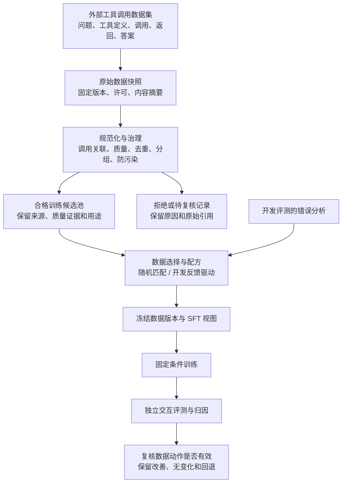

# Feature Specification: Agent 工具调用轨迹数据工厂

**Feature Branch**: `docs/external-dataset-flow-v21`；沿用特性目录 `001-code-data-factory`

**Created**: 2026-09-03 | **Revised**: 2026-09-10 | **Revision**: 2.1

**Status**: 2.1 数据来源修订完成；现有实现和已勾选任务仅证明其原验收范围，新版外部训练数据准入与交付尚待实施。

**Input**: 大模型数据工程项目。正式训练示范从外部开源数据集获取，主对象为已有示范及其任务与工具调用轨迹；
首版采用监督微调（Supervised Fine-Tuning，SFT）与真实交互评测验证数据价值；必须支持后续
强化学习（Reinforcement Learning，RL）和更困难、奖励稀疏的长程任务扩展。优先复用开源组件，
工程重点为数据生产、批处理、质量、多样性、版本、谱系、反馈与归因。

**Revision boundary**: 2.1 按用户确认，将正式训练数据来源改为外部已有示范，取消“本地构造任务后
重新采样作为正式训练数据来源”的路线。2.0 的代码目标迁移仍保留；本版修订来源、准入、流向及
验收边界。需求按“规格版本 + 编号”解释，旧产物不得被重标为新验收完成。
迁移与待修契约见 [plan.md](plan.md#protocol-migration)；具体工作见 [tasks.md](tasks.md)。

## Authoritative Data Flow

SFT 为监督微调。主流向固定为：外部已有示范 → 数据治理 → 可用训练候选池 → 数据配方 →
训练版本与视图 → 固定条件训练与独立评测 → 反馈归因。外部发布者自行合成的数据仍是外部来源，
必须记录其合成属性；本项目不自行采样来构建或补足首版正式训练池。

- 外部原始记录只读留存；格式修复、唯一可确定的调用关联修复生成新记录，保留原始版本、父记录、
  修复规则与审核依据。缺少工具返回/答案不能靠重新调用工具或模型生成后冒称原示范。
- 训练准入、可重放性、任务结果/奖励证据分别审核；环境不可恢复不单独否定示范资格，证据不足的
  示范仍须待复核或拒绝。来源宣称成功与本项目实际验证结果分开，未知结果/奖励不补为成功或零。
- 可执行环境服务于交互评测、可重放子集核验和后续 RL 采样兼容。受控任务、测试夹具及本项目
  模型采样输出不进入首版正式 SFT 池，缺环境不能阻塞外部示范的数据治理与发布。
- 开发反馈优先改变同一候选池的选择和配比；新增外部来源、修复记录重新经过治理，进入下一候选池
  版本。冻结后的对照实验不得追加某一组专有数据；最终测试数据不得进入反馈或训练。

## User Scenarios & Testing

用户故事（User Story，US）按优先级（Priority，P）排序；P1 为必需基础能力，P2 为下游闭环验证。
独立测试可使用已准备的固定输入，不要求其他故事先完成全规模交付。

### User Story 1 - 生产可追踪的任务与轨迹数据版本 (Priority: P1)

作为数据工程师，我希望将外部开源数据集中的已有工具调用示范，转为可治理、可审核、可增量
发布的训练数据；训练内容保留外部来源身份，让数据使用者知道每条记录从哪里来、为何被接受或拒绝。

**Why this priority**: 这是项目主交付物，直接覆盖数据解析、转换、质量、采样和训练数据交付。

**Independent Test**: 对固定输入构建两次数据版本，再新增、撤销各一组来源；比较内容、决策和受影响
产物，并审阅失败数据保留情况；至少一个真实外部来源能在不调用模型生成、也不依赖本地任务环境的条件下完成训练版本发布与导出。

**Acceptance Scenarios**:

1. **Given** 有来源和许可记录的原料，**When** 规范化与治理，**Then** 每条任务和轨迹都有稳定标识、
   来源与转换记录；缺失初始状态或工具依赖的历史数据不得被标为可重新执行。
2. **Given** 成功、失败和恢复轨迹混合的原始池，**When** 生成 SFT 数据，**Then** 仅导出满足规则的
   示范，但原始失败记录仍可追溯，修复结果形成新记录。
3. **Given** 相同输入和规则，**When** 本地或分布式执行及失败重试，**Then** 逻辑结果相同，发布不重复，
   不完整分片不进入版本；新增来源只重算必要分区，跨分区去重与切分仍全局一致。
4. **Given** 来源撤销或发现敏感内容，**When** 执行生命周期治理，**Then** 可定位受影响数据、实验和结论，
   并撤销分发或失效标记，保留不包含敏感正文的审计信息。
5. **Given** 完整外部示范的原环境无法恢复，**When** 按冻结示范规则审核，**Then** 可按质量证据
   获得训练资格；重放能力保持不支持，结果/奖励证据不得虚构。缺关键上下文或质量证据则待复核。
6. **Given** 数据存在确定可修复的格式问题，**When** 修复后重新审核，**Then** 训练成员关联原记录、
   派生记录和修复依据；不能用本项目重新采样的答案替换为“外部原始答案”。

### User Story 2 - 判断工具轨迹是否真正完成任务 (Priority: P1)

作为数据工程师，我希望独立检查工具选择、参数、跨步骤依赖、结果和任务约束，避免把格式正确、
工具无报错或模型自称成功当作任务成功。

**Why this priority**: 错误的成功标签会污染质量判断与奖励；验证分支补充证据，不作为所有外部示范训练发布的统一前置条件。

**Independent Test**: 运行包含正确结果、错误参数、错用中间结果、超时、预算耗尽、验证器故障和
工具假成功的固定案例，重新计算全部判定。

**Acceptance Scenarios**:

1. **Given** 查询结果为 86 华氏度，**When** 下一步错误地对 68 华氏度进行换算，**Then** 即使工具
   无错误返回，系统仍记录依赖错误并按最终目标判定；工具调用成功率不能替代整任务成功率。
2. **Given** 相同任务、初始条件和动作序列，**When** 在冻结环境中重新执行，**Then** 返回与最终
   判定一致或给出具体差异；读取旧日志不被称为重新执行。
3. **Given** 验证器不可用或证据不足，**When** 评分，**Then** 结果为未知并记录原因，不能填零奖励。
4. **Given** 两条不同但都正确的解题路径，**When** 验证结果，**Then** 均可通过；不要求复制示范的
   唯一调用顺序，也不向模型暴露隐藏参考答案或验证反馈。

### User Story 3 - 以评测反馈调整数据并形成归因闭环 (Priority: P2)

作为数据工程师，我希望把开发评测中的失败映射到数据切片，提出原因假设，执行有针对性的数据动作，
再检验变化是否有效，而不止输出质量分数。

**Why this priority**: 反馈必须实际改变数据，并连接后续结果，才能展示数据决策能力。

**Independent Test**: 从开发评测定位一次跨步骤依赖错误，生成带理由的数据选择配方，发布新版本，
记录复评结果和相反证据。

**Acceptance Scenarios**:

1. **Given** 带完整尝试记录的开发评测，**When** 诊断，**Then** 发现关联具体步骤、可见上下文、
   能力切片和证据；系统故障与模型错误分开，诊断假设不被宣称为因果事实。
2. **Given** 一项反馈驱动的数据动作，**When** 新版本发布，**Then** 可以追溯原始发现、选择规则、
   受影响记录、配比变化和复验计划。
3. **Given** 复评无改善或出现回退，**When** 关闭迭代，**Then** 保留实际结果；最终测试集不得反向
   用于生成、调参或选择正式数据。新增来源和修复先进入下一候选池版本；首轮比较只在同一冻结外部池重选。

### User Story 4 - 用固定条件实验测量数据价值 (Priority: P2)

作为数据工程师，我希望以相同训练条件比较反馈驱动选择和匹配随机选择的数据，测量它们对真实
工具交互任务完成情况的影响。

**Why this priority**: 模型训练提供最小下游证据，不能以数据规模或训练损失代替数据价值。

**Independent Test**: 对两组数据完成三个相同随机种子的 SFT 和隔离交互评测；若缺少运行依赖，
验证报告明确显示未完成，不能发布模型收益。

**Acceptance Scenarios**:

1. **Given** 同候选池、已登记目标数据差异及匹配条件，**When** 训练两组模型，**Then** 训练方法、
   有效训练词元、更新步数等非目标条件一致，并保留六次运行全部终态。
2. **Given** 训练后模型，**When** 评测，**Then** 每一步工具返回来自当前动作的实际执行；不得在
   模型走错路径后继续喂历史示范的正确返回。
3. **Given** 结果波动、预算不等、证据缺失或护栏回退，**When** 报告，**Then** 按真实情况给出
   负向、不确定、未完成或失效结论；不把训练前后差异自动归因为数据策略。

### User Story 5 - 独立核验数据生产与实验成果 (Priority: P2)

作为评审者，我希望从简洁报告定位每项结论的原始数据、成本、失败记录和重跑入口。

**Why this priority**: 求职项目需要可核验成果，不能依赖演示界面或口头补充。

**Independent Test**: 重建一个数据版本，重算一个质量指标和一个模型比较指标，再故意删除一项证据。

**Acceptance Scenarios**:

1. **Given** 发布的结论，**When** 审阅证据清单，**Then** 可双向定位数据、处理、交互、训练、评测和
   成本；缺失证据时自动降低结论层级或拒绝发布。
2. **Given** 固定规模工作负载，**When** 比较不同实际工作节点数，**Then** 报告吞吐、资源、重试、
   结果等价性与成本，保留无加速结果；用于性能测试的复制数据不冒充独立训练任务。

### User Story 6 - 无需重建数据核心即可扩展 RL 与长程任务 (Priority: P1)

作为后续数据与训练开发者，我希望复用任务、环境、轨迹和验证器，接入现成 RL 训练器，并承载
更长、更难、只有终局奖励的任务。该能力是首版必须验收的设计与适配能力，不是可选导出格式。

**Why this priority**: 现在丢失的上下文、来源和结束语义无法靠未来增加字段恢复。

**Independent Test**: 同一任务经交互评测和选定训练框架的采样入口执行；另以长程固定案例检查
上下文变化、中断、恢复和稀疏奖励统计，不运行正式 RL 参数优化。

**Acceptance Scenarios**:

1. **Given** 同一冻结任务包，**When** 分别由评测与训练采样入口调用，**Then** 共用工具、初始状态和
   验证逻辑，无需更改数据核心实体；仅新增适配及训练专用产物。
2. **Given** 不同模型对同一任务多次尝试，**When** 保存，**Then** 每次尝试独立关联实际策略版本、
   观察、动作和结果；历史示范不得冒充当前策略采样。
3. **Given** 32 步和 128 步的固定长程案例，**When** 保存、分片读取和恢复，**Then** 顺序、依赖、
   每轮模型可见内容以及中断原因完整；没有状态恢复能力的环境必须明确拒绝从中间执行。
4. **Given** 只有终局成功奖励的一组轨迹，**When** 统计，**Then** 保留已知零奖励、未知奖励、预算
   截断和全失败任务的独立计数；过程质检不得自动转换成密集奖励。
5. **Given** 未来训练消费需要原始采样词元和对应来源标记，**When** 历史记录缺失这些信息，**Then**
   拒绝相应消费资格，仍可按其他条件用于示范；不补造概率或词元采样证据。首版真实采样仅为兼容探针，不进入正式 SFT 池。

### Edge Cases

- 多个并发调用、重复返回、乱序返回、缺少调用标识：保留原始信息，只有唯一可确定的关联才可修复。
- 合法失败后恢复、前半段错误后最终正确：分别记录过程质量和终局结果，不把整条成功轨迹默认当好示范。
- 工具返回过大、消息被截断或摘要：保存原始产物引用与实际可见内容，不能用事后完整日志替代模型输入。
- 来源文档、工具或验证器升级：创建新版本，区分重新评分与重新执行，旧实验不能静默混入新版本。
- 同模板不同措辞、同来源不同切块、同任务不同轨迹：按共享来源和任务关系切分，防止跨集合泄漏。
- 参数、单位、时间边界或引用合法但含义错误：必须验证目标值及证据对应，不能只校验格式。
- 奖励全部为零、部分未知或验证器假阳性：分别报告；不以加密集奖励的方式自动掩盖问题。
- 工具/模型外部调用成功后客户端中断：保留未知执行状态；只有幂等或只读动作允许受控重试。
- 分布式批次部分写出、已提交后重试、撤销来源连接到多个实验：不得重复发布或漏做影响分析。
- 缺少图形处理器（Graphics Processing Unit，GPU）或真实隔离环境：保留可完成的软件证据，未完成
  门禁仍为未完成，不把降级报告当成全部项目验收通过。

## Requirements

### Scope Boundaries

主场景为“信息查询、计算、单位与时间转换助手”：从冻结资料读取信息，组合工具完成比较、换算和
带证据的回答。训练来源按查询、计算/转换和跨步依赖等能力相关性筛选，不要求其原工具名称等同
本地四个工具；保留上游工具定义和语义，不能重写成不真实的本地调用。交互评测任务以可独立验证
的文本/结构化结果为目标。来源不匹配时重新筛选外部来源，不能转为本地自造训练任务。
首版不做通用图形界面操作、办公文件视觉排版、网页反爬、底层存储研发、多模态训练、服务平台或
自训练算法研究。正式 RL 和长程能力收益实验属于后续阶段；它们的接口和数据兼容验收属于首版。

### 租用 Linux 恢复与依赖验证边界

T003/T012 的 Linux 依赖证据必须遵守[租用 Linux 环境恢复与依赖验证契约](contracts/rented-environment-recovery.md)。
租用实例的持久目录只在实际复用同一 workspace/storage identity 时可作为缓存；新实例必须从独立保留的
源码与锁文件恢复。依赖安装和 Parquet 读写通过仅构成 `SOFTWARE_VALIDATED`，不得升级为隔离执行、
分布式处理、训练或模型价值结论。

### Functional Requirements

功能需求（Functional Requirement，FR）必须由下列成功标准及对应用户故事验收。

- **FR-001**: 项目必须交付外部任务/轨迹示范的获取与治理、批处理、质量与多样性、版本谱系、交互验证、反馈和数据归因，
  开源通用能力优先复用；自有实现必须说明所解决的数据语义缺口。
- **FR-002**: 任务与示范必须独立建模；外部示范可只引用上游任务标识/问题和工具定义，缺失环境字段保持缺失；每个可执行任务另含初始资源、工具版本及独立判定标准。
- **FR-003**: 来源须固定版本和内容摘要，记录许可、用途、合成属性与生成上下文；缺少依赖不得宣称可执行。
- **FR-004**: 原始任务和所有尝试均保留；接受、拒绝、隔离、修复、删除和重选须有理由、证据和版本。
- **FR-005**: 发布前阻断不合格许可、明显凭据/敏感信息及已知评测污染，并支持撤销后的影响追踪。
- **FR-006**: 标准轨迹必须支持多次尝试、逐轮观察、模型输出、工具调用/返回关联和原始产物引用。
- **FR-007**: 每轮须能恢复模型实际可见内容；摘要、截断和外部干预显式记录，不覆盖原始事件。
- **FR-008**: 区分正常结束、预算截断、环境故障、取消和进程中断；执行状态与任务判定相互独立。
- **FR-009**: 工具执行与验证器必须可独立调用并复用于评测和后续训练，隐藏答案与评判证据不得泄漏给模型。
- **FR-010**: 执行需有隔离、非特权、固定环境和资源限制；环境不合格时不得授予安全执行证据。
- **FR-011**: 至少区分日志回看、固定动作重新执行、模型重新采样和固定证据重新评分四种操作及其产物。
- **FR-012**: 判断任务成功必须检查最终结果、必要证据和约束，允许不同正确路径；工具无报错不构成成功。
- **FR-013**: 验证器必须接受独立正/负对照审计；未知、错误、证据不足和不稳定判定不得转换成确定成功或零奖励。
- **FR-014**: 结构、依赖、示范质量和结果质量分开记录；训练准入引用冻结审核规则与证据，不要求全部成员具有本地执行 PASS；有效失败恢复轨迹需按示范规则审核。
- **FR-015**: 精确重复、近重复、任务同源和评测污染分别处理；工具名相同不构成语义重复证据。
- **FR-016**: 同源文档、模板派生与重复任务建立分组切分；切分归属在生成变体前冻结，新增数据不得改变已冻归属。
- **FR-017**: 质量和多样性报告须含来源、任务类型、依赖深度、步骤数、长度、恢复类型、验证强度、处理前后分布。
- **FR-018**: 按来源记录原始示范→规范记录→合格候选→发布成员的数量、保留率、拒绝原因、抽检差异、有效训练词元与单位合格示范成本；原始任务数、派生数和轨迹数分开，无产出时成本不可计算。
- **FR-019**: 本地及分布式处理必须共享数据语义，支持幂等提交、有限重试、增量重算和中断恢复。
- **FR-020**: 数据集不可变发布，包含成员、来源、去重/切分关系、配方、质量报告、内容摘要和重建入口。
- **FR-021**: 删除和更正可双向定位受影响来源、轨迹、版本、训练、评测与结论，避免静默抹除失败记录。
- **FR-022**: SFT 视图须保存完整必要前缀，只让选定模型输出参与训练损失；工具返回、用户输入和填充不参与。
- **FR-023**: 质量分数、选择分数、诊断项与训练奖励必须独立定义和版本化，禁止无依据互换。
- **FR-024**: 反馈动作只能读取开发评测，关联发现、原因假设、目标切片、配方变动和复验结果。
- **FR-025**: 首版以同一个外部合格候选池构建随机匹配与反馈选择两个配方、三个固定种子进行 SFT；只测一个预先声明的数据差异，不混入本项目采样示范。
- **FR-026**: 按宪章固定训练方法、初始化、有效词元、步数、曝光规则、计算预算和评测条件；匹配不能消除目标干预。
- **FR-027**: 主评测必须为固定交互预算下一次完整尝试的任务成功率，另报恢复、未见组合、成本和约束遵循。
- **FR-028**: 外部工具调用基准与项目任务分别报告，冻结版本、子集和协议偏离；禁止混成总分或冒充官方完整分数。
- **FR-029**: 保存所有正式运行终态、逐题结果、随机性波动和费用；模型收益必须有实际参数更新及公平对照证据。
- **FR-030**: 发布结论须有稳定标识、证据层级、原始产物、限制、相反结果和可复现入口；指标可从明细重算。
- **FR-031**: RL 与长程扩展兼容是首版强制要求；扩展通过适配或附加记录完成，不得要求重建任务、轨迹与验证核心。
- **FR-032**: 首版须完成一个现成训练框架的环境接口契约测试及真实模型采样探针；不要求 RL 参数更新，
  测试替身通过、真实采样兼容和 RL 训练收益必须分别报告。
- **FR-033**: 未来在线采样须关联实际策略、采样配置、词元和模型输出标记；历史来源缺失信息时保留缺失，拒绝冒充。
- **FR-034**: 轨迹结构不得硬编码首版步数或上下文上限，必须通过 32/128 步测试，保存依赖、上下文变化和终止语义。
- **FR-035**: 声明环境是否可复位、可固定动作重执行、可保存/恢复状态；至少一个受控环境验证恢复，其他环境不可伪造支持。
- **FR-036**: 支持只有终局奖励的记录、重新评分、难度与奖励分布报告；已知零、未知和全失败任务必须可区分。
- **FR-037**: 后续 RL 实验须单独登记在线采样与优化预算、奖励规则和任务分布；不得混入首版 SFT 归因。
- **FR-038**: 分布式性能证据必须来自真实节点、固定输入和重复测量，并包含输出等价、故障恢复、资源和成本。
- **FR-039**: 复制扩容的性能数据必须与训练、开发、测试严格隔离，不能计入独立任务规模或多样性。
- **FR-040**: 研究来源和组件选型遵守宪章时效与验证要求；每个交付检查点同步复核本机私有决策记录，不公开引用该记录。
- **FR-041**: 正式训练示范须来自有版本的外部开源数据集；每个目标片段反查源分片/记录/消息及转换。首版不以本地任务构造、重新采样、评测轨迹或性能副本供给训练池。
- **FR-042**: 示范审核、重放能力、结果/奖励证据及训练消费资格分别保存；无法重放不能单独否决 SFT，也不能自动批准。缺工具定义、关键上下文或有效质量依据时拒绝或待复核，不补造证据。
- **FR-043**: 外部合格数据发布须能在没有本地交互环境、模型生成调用和采样探针结果时独立完成；实际交互评测与后续 RL 兼容仍通过各自门禁，不能用此发布替代。
- **FR-044**: 扩量依据外部来源审计、保留率、能力覆盖、有效词元与预算；新增来源/修复都经过同一治理，进入新候选池版本。来源不足时继续选源或记录未达标，不自行采样补量。

### Key Entities

- **来源快照**：带许可、版本、内容摘要和用途的输入事实。
- **任务包**：独立于示范的目标、初始条件、工具及验证配置；关联模板族和来源组。
- **交互尝试与事件**：同一任务的一次执行及逐轮记录，包含结束原因、可见上下文和生成身份。
- **验证与奖励记录**：独立判定、证据和可选奖励映射；允许未知，不覆盖原始证据。
- **数据决策与版本**：接受/拒绝、去重、切分、配方与不可变成员列表。
- **评测发现与数据动作**：连接失败证据、原因假设、目标切片和复验结果。
- **实验与运行**：固定计划、训练/采样/评测终态、资源、成本和原始产物。
- **兼容性回执**：明确记录某任务环境及适配器已验证的能力和证据，不使用笼统的“RL-ready”标签。
- **发布结论**：带层级、限制、双向谱系和重跑入口的精确陈述。

## Success Criteria

成功标准（Success Criterion，SC）中的数量为验收下限，不是已经取得的结果。软件级验证证明
数据/接口行为；执行级验证须有真实隔离运行；训练证据级须满足宪章 I–III，不能相互替代。

### Measurable Outcomes

| 编号 | 可核验成果与判定 | 对应需求 | 目标证据及产物 |
|---|---|---|---|
| **SC-001** | 100% 发布成员可追溯来源、许可、全部转换及选择原因；撤销来源能列出全部受影响对象 | FR-003–005、020–021 | 软件级；成员、谱系及撤销台账 |
| **SC-002** | 验证分支的至少 100 个独立任务覆盖查询、计算/转换、跨工具组合；逐条给出可执行性与判定依据，改写不重复计任务；该集不是正式训练示范来源 | FR-001–003 | 执行级；先导审计和运行结果 |
| **SC-003** | 正确、错参数、错依赖、假成功、预算截断、环境故障、未知判定各至少 5 例，分类与人工预期完全一致 | FR-008–014 | 执行级；至少 35 例正负对照与原始日志 |
| **SC-004** | 所有导出示范能恢复必要上下文；用户、工具和填充的训练损失标记为零；导出前后原始失败记录数不变 | FR-004、006–007、014、022 | 软件级；导出审计与词元对齐记录 |
| **SC-005** | 发布集不存在已知跨集合来源/模板/重复簇泄漏；近重复候选至少抽审 100 对并报告误合并和漏检探针 | FR-015–017 | 软件级；切分清单与人工复核 |
| **SC-006** | 全量与增量构建、本地与分布式构建的逻辑内容和决策一致；覆盖写入前后故障各一次，无重复/部分发布 | FR-019–020 | 软件级；等价与恢复报告 |
| **SC-007** | 每版按来源报告原始/规范/合格/发布示范数与保留率、独立任务及派生数、有效词元、拒绝与覆盖、奖励可计算率和费用，均可由明细重算 | FR-017–018、023、036 | 软件级；数据卡与质量成本报告 |
| **SC-008** | 至少一条开发评测→发现→数据动作→新版本→复评闭环完整，包含无改善或回退的记录方式 | FR-024 | 训练证据级；实际复评及反馈链，软件探针单列 |
| **SC-009** | 两配方×三个种子共六次正式训练终态完整；相同有效词元/步数与条件，不以取得正收益为完成条件 | FR-025–026、029 | 训练证据级；预登记、模型和运行产物 |
| **SC-010** | 主评测每项有完整实际交互、独立结果判定、终态、成本；外部基准单独出表并保留协议偏离 | FR-027–030 | 执行级及训练证据级；逐题评测 |
| **SC-011** | 同一任务包无需修改核心实体，经交互评测与一个现成训练框架采样入口执行；至少两任务各两次真实模型采样，检查环境语义和词元/输出标记 | FR-009、031–033 | 软件级接口与真实采样回执；不证明 RL 更新 |
| **SC-012** | 32 步、128 步固定案例均通过无损存读；各含跨步骤依赖，另覆盖至少一次上下文改写和中断恢复；不执行的环境明确拒绝恢复 | FR-006–008、034–035 | 软件级长程契约及受控环境执行回执 |
| **SC-013** | 对含成功、全失败、未知与截断的固定轨迹重算两个奖励版本，原始证据不变、差异可解释；不自动生成密集奖励 | FR-011、013、023、036–037 | 软件级；重评分及稀疏奖励报告 |
| **SC-014** | 在相同不少于 64 吉比字节的逻辑输入上，1/2/4 个真实工作节点各 5 次测量，输出等价且有故障注入和完整费用；无加速也完整报告 | FR-038–039 | 软件级真实分布式记录；吉比字节指 2 的 30 次方字节 |
| **SC-015** | 独立复现一个数据版本、重算一项评测指标；删除证据后发布门禁准确阻断；每个故事有本机记录复核回执 | FR-030、040 | 软件级；复现和证据审计 |
| **SC-016** | 至少一个真实外部开源数据集经审计、治理、版本发布和 SFT 导出；100% 训练目标可追溯上游记录及修复链；本项目采样/评测/夹具混入数为零；实际合格示范与有效训练词元均非零，逐阶段数量/保留率可对账 | FR-001、020、022、025、041、044 | 数据治理的软件级真实原料/发布证据；不代表执行或训练收益 |
| **SC-017** | 四类独立案例分别验证：完整不可重放示范按规则准入；缺工具定义/上下文拒绝；上游自称成功不变成实际 PASS/奖励；修复后原记录与派生关系可追溯 | FR-002–004、014、041–042 | 软件级；准入决策与正反例，不伪造结果真值 |
| **SC-018** | 对同一真实外部冻结输入，在无本地任务环境且禁用模型生成调用时仍完成发布/导出，输出成员与逻辑哈希一致；缺质量证据版本准确阻断 | FR-019–020、042–043 | 软件级；独立发布与拒绝回执，不要求重新跑 Agent |

## Assumptions

- 使用现有特性目录修订，保留约 12 周首版周期；扩大到正式 RL 训练须另列实施阶段和预算。
- 目标部署环境为 Linux；单人批处理项目，无在线服务可用性承诺。
- 外部已有示范为正式训练来源；上游已合成的数据需标注属性。本项目不重新采样供给首版训练池，训练资格依分用途审核，不能与环境重建能力绑定。
- 冻结资料和数值规则仅用于有界验证/评测/兼容任务；正式训练规模取决于外部合格数据，不以这些任务派生补量。
- 具体数据规模、模型资源和正式有效训练词元须经先导与校准后冻结；不承诺公开原料天然合格或模型必然提升。
- 32/128 步是长程数据结构与执行协议压力验收，不声称模型已经具备相应长程任务能力。
